# Redis Solution Architect Assignment — Part 1

## 📌 Objective

Set up Redis OSS and Redis Enterprise, load data, and configure replication from Redis OSS (Server A) to Redis Enterprise (Server B).

---

## 🏗️ Architecture

* **Server A**: Redis OSS (Primary)
* **Server B**: Redis Enterprise (Replica)

```text
Redis OSS (Server A)  ─────────▶  Redis Enterprise (Server B)
```

---

## ⚙️ Redis OSS Setup (Server A)

* Installed Redis OSS version **7.2.0**

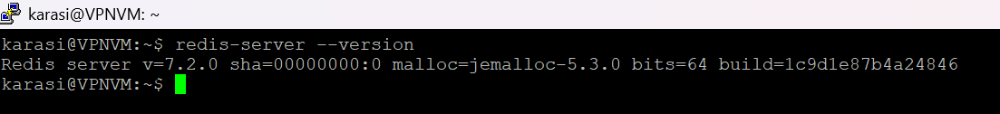

* Deployment done directly on VM (no Docker, as per requirement)

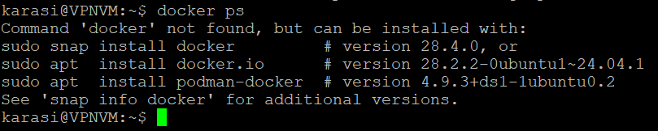

* Redis process validation

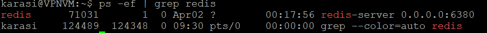

* Connectivity test (PING)

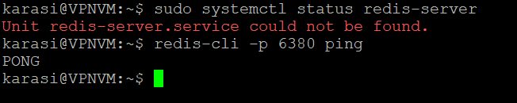

---

### Configuration Changes

* Changed default port:

```
port 6380
```

* Enabled persistence using AOF:

```
appendonly yes
appendfsync everysec
```

* Redis configuration file:

```
/etc/redis/redis.conf
```

---

## 📦 Data Loading

Used `memtier-benchmark` to generate and load test data.

### Command Used:

```
memtier_benchmark -s 127.0.0.1 -p 6380 --protocol=redis --clients=10 --threads=2 --ratio=1:0 --data-size=100 --key-pattern=R:R --key-minimum=1 --key-maximum=100000 --requests=100000
```
### Observations:

* Successfully loaded ≥100,000 keys
* Achieved high throughput with low latency

### Benchmark Evidence

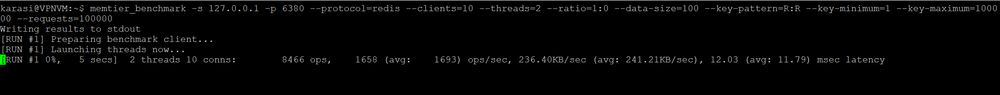

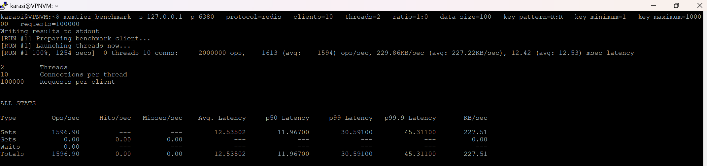

---

## 🏢 Redis Enterprise Setup (Server B)

* Installed latest Redis Enterprise

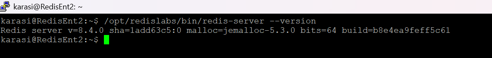

* Configured cluster using no-DNS setup

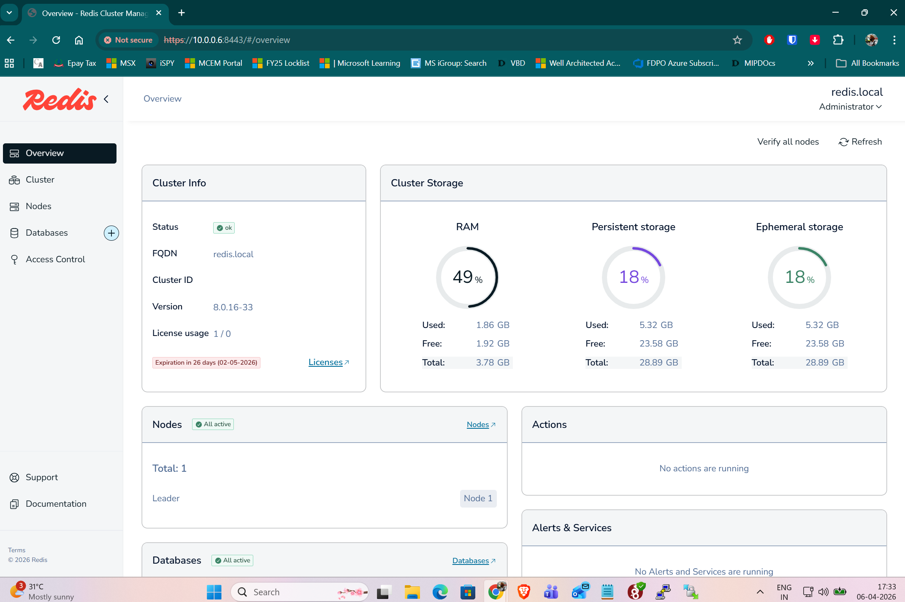

* Created a database to receive replicated data

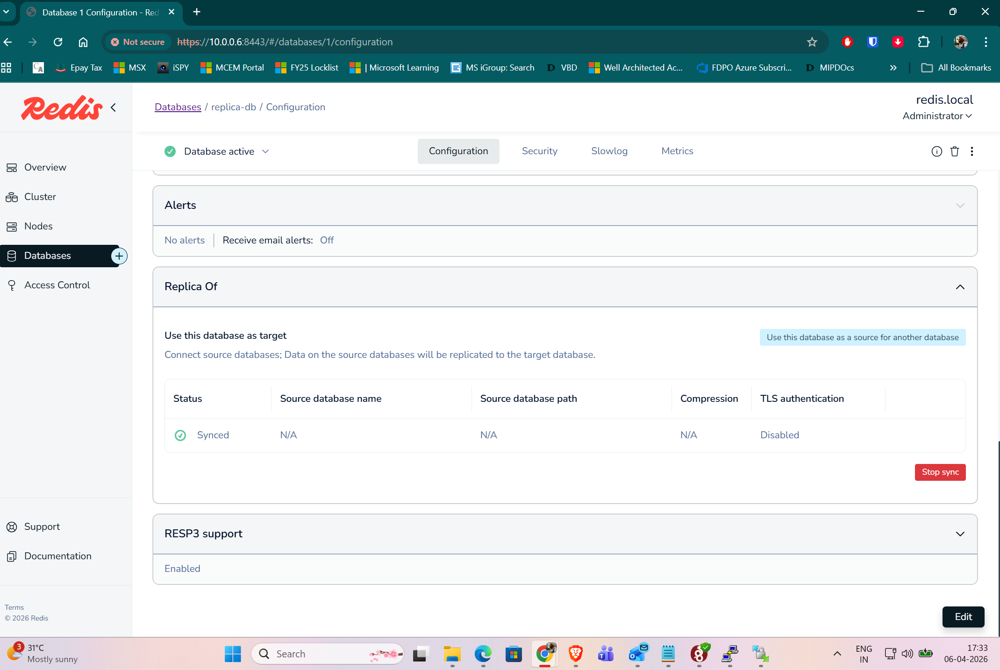

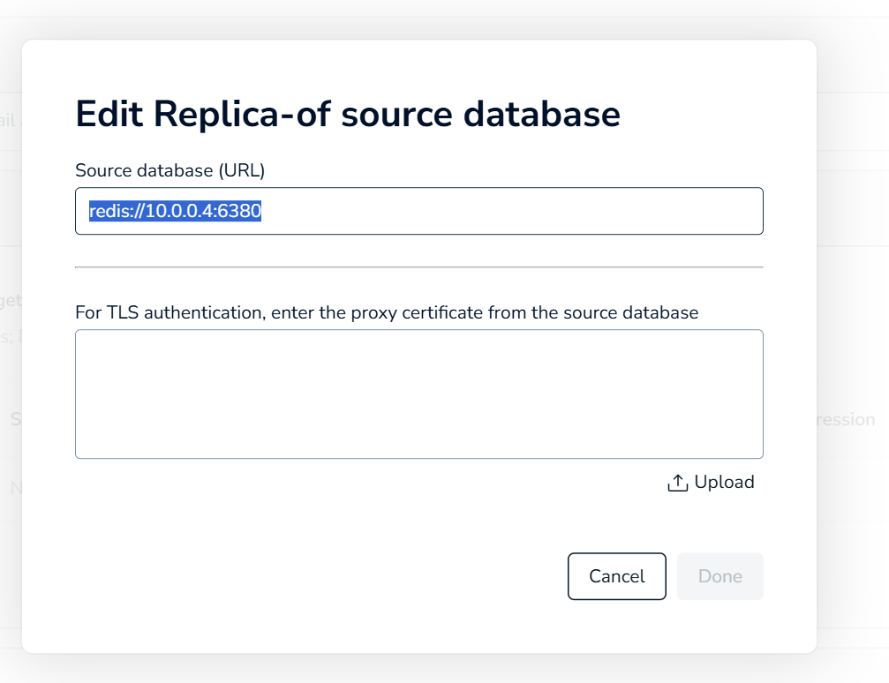

---

## 🔁 Replication Configuration

Replication was configured from **Redis OSS (Server A)** to **Redis Enterprise (Server B)** using the Redis Enterprise UI during database configuration.

### Validation

* Verified that key count on Redis OSS matched Redis Enterprise database

**Server A (OSS) Key Count**

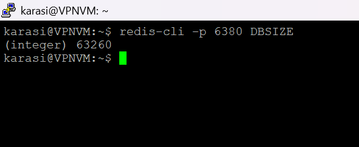

**Server B (Enterprise) Key Count**

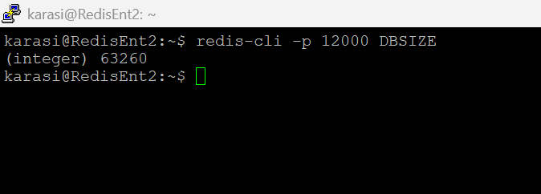

* Confirmed data replication via Redis Enterprise dashboard

---

## 📊 Validation Commands

Checked key count on Redis OSS:

```
redis-cli -p 6380 DBSIZE
```

---

## 🧠 Learnings

* Changing Redis port requires updating all client connections
* AOF provides better durability guarantees compared to RDB
* Redis Enterprise simplifies replication setup via UI

---

## ⚠️ Challenges Faced

* Initial connectivity issues due to custom port configuration
* Resolved by validating Redis configuration and ensuring correct port usage

---

## ✅ Outcome

* Redis OSS successfully configured with persistence
* Data loaded using memtier-benchmark
* Replication to Redis Enterprise validated
